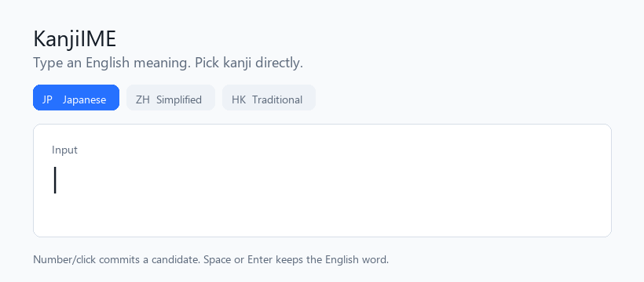
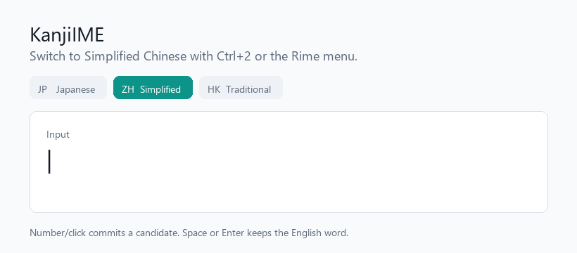
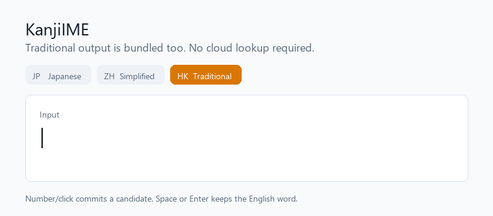

# KanjiIME

KanjiIME is a Rime-powered English-to-Japanese/Chinese input method for Windows and Android.
Type an English meaning, then commit Japanese kanji, Simplified Chinese, or Traditional Chinese directly from the candidate list.

No cloud translation, no copy-paste workflow, no switching to a browser. It feels like a normal IME, but the lookup key is English.

## Download

Get the latest builds from the GitHub releases page:

**https://github.com/Rmnesia/KanjiIME/releases**

Choose the package for your device:

- **Windows:** download `KanjiIME-Weasel-Setup.exe`
- **Android:** download `KanjiIME-Android.apk`

On Windows, the installer is based on Rime Weasel and includes the KanjiIME dictionaries. On Android, the APK is based on Trime and ships with the same JP/ZH/HK modes.

## See It Work

Type an English word and choose a candidate with number keys, mouse, or touch.







## Screenshots


## What You Can Type

Examples:

- `fire` -> `火`, `炎`, `火災`, `火事`
- `water` -> `水`, `河`, `水流`
- `love` -> `愛`, `恋`, `喜愛`

Select a candidate by pressing its number or clicking/tapping it.

Press `Space` or `Enter` while composing to keep the English word itself. For example, `fire` + `Space` commits `fire`.

## Three Output Modes

KanjiIME includes three Rime schemas:

- `kanji_en_jp` - Japanese-oriented kanji output
- `kanji_en_zh` - Simplified Chinese output
- `kanji_en_hk` - Traditional Chinese / Hong Kong output

Switch modes from the Rime schema menu, usually with `Ctrl+\`` or `F4`.

On Windows, the bundled hotkeys are:

- `Ctrl+1` - Japanese
- `Ctrl+2` - Simplified Chinese
- `Ctrl+3` - Traditional Chinese / Hong Kong

## Why KanjiIME

- Type from meaning, not pronunciation.
- Use one English vocabulary to reach Japanese and Chinese text.
- Works locally with bundled dictionaries.
- Ships with a large offline vocabulary instead of asking users to download dictionaries after installation.
- Built on mature Rime projects: Weasel for Windows and Trime for Android.

## Repository Layout

```text
rime/                  Rime schemas and dictionaries
tools/                 Dictionary import and merge tools
scripts/               Windows and Android package builders
packaging/windows/     Windows installer helper files
assets/                README demo GIFs
```

## Build Windows Installer

KanjiIME uses Rime Weasel on Windows. The current packaging flow builds a Weasel-based NSIS installer and bundles the KanjiIME dictionaries before installation.

```powershell
pwsh ./scripts/Build-WindowsWeaselInstaller.ps1
```

Output:

```text
dist/windows/KanjiIME-Weasel-Setup*.exe
```

## Build Android APK

KanjiIME uses Trime on Android. The packaging script copies the KanjiIME Rime assets into the Android build and runs Gradle.

```powershell
pwsh ./scripts/Build-AndroidApk.ps1
```

Output:

```text
dist/android/*.apk
```

## Dictionary Development

Local source dictionaries are TSV files:

```text
mode<TAB>english<TAB>candidate<TAB>weight<TAB>comment
jp<TAB>fire<TAB>火<TAB>100<TAB>hi
zh<TAB>fire<TAB>火<TAB>100<TAB>huo
hk<TAB>fire<TAB>火<TAB>100<TAB>fo
```

Use `mode` values `jp`, `zh`, `hk`, or `all`.

Rebuild Rime dictionaries after editing `data/seed.tsv` or adding TSV files:

```powershell
pwsh ./tools/Build-Dictionaries.ps1
```

Import an online TSV dictionary:

```powershell
pwsh ./tools/Import-Dictionary.ps1 -Url "https://example.com/kanjiime.tsv" -OutFile data/external/example.tsv
pwsh ./tools/Build-Dictionaries.ps1
```

## Sources

KanjiIME is built on:

- Rime engine: https://rime.im
- Weasel for Windows: https://github.com/rime/weasel
- Trime for Android: https://github.com/osfans/trime
