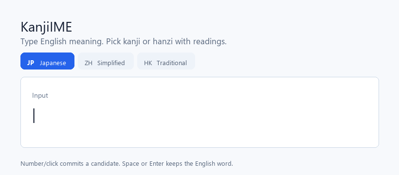
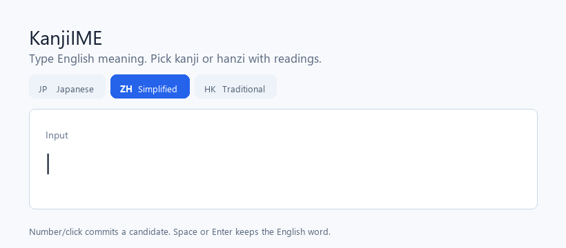
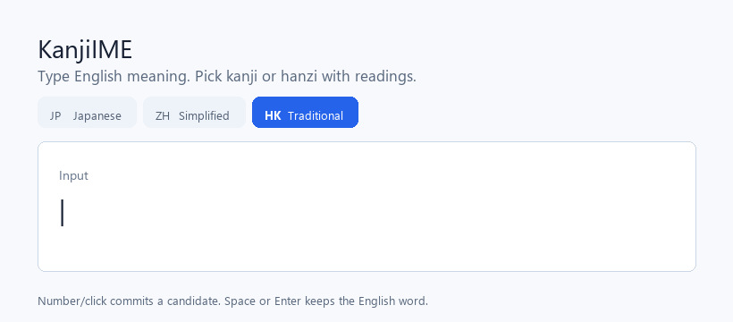

# KanjiIME

KanjiIME is a free, open-source, nonprofit English-to-Japanese/Chinese input method for Windows and Android.
Type an English meaning, then commit Japanese kanji, Simplified Chinese, or Traditional Chinese directly from the candidate list.

Also, it shows pronunciation hints beside candidates: Japanese entries can show kana readings, while Chinese entries show romanized readings. You still type by meaning, but now you get a small pronunciation reminder before you commit.


No cloud translation, no copy-paste workflow, no browser lookup. It feels like a normal IME, but the lookup key is English.

## Download

Get the latest Windows installer and Android APK from GitHub Releases:

**https://github.com/Rmnesia/KanjiIME/releases**

- **Windows:** download `KanjiIME-Weasel-Setup.exe`
- **Android:** download `KanjiIME-Android.apk`

Both packages include the offline dictionaries. Users do not need to download dictionary files after installing.

## See It Work

Type an English word, browse candidates with pronunciation hints, then press a number key or click/tap a candidate.







## What You Can Type

Examples:

- `fire` -> `火 (ひ)`, `炎 (ほのお)`, `火災 (huozai)`, `火事 (かじ)`
- `friend` -> `友達 (ともだち)`, `朋友 (pengyou)`, `好友 (haoyou)`
- `kind` -> `親切 (しんせつ)`, `善良 (shanliang)`, `友善 (youshan)`

Select a candidate by pressing its number or clicking/tapping it.

Need only the pronunciation? On Windows, press `Shift` + a candidate number to commit that candidate's reading instead of its kanji/hanzi. On Android, long-press a candidate to commit its reading.

Press `Space` or `Enter` while composing to keep the English word itself. For example, `fire` + `Space` commits `fire`.

## Three Output Modes

KanjiIME includes three Rime schemas:

- `kanji_en_jp` - Japanese-oriented kanji output with kana readings
- `kanji_en_zh` - Simplified Chinese output with pinyin-style readings
- `kanji_en_hk` - Traditional Chinese / Hong Kong output with romanized readings

Switch modes from the Rime schema menu, usually with `Ctrl+\`` or `F4`.

On Windows, the bundled hotkeys are:

- `Ctrl+1` - Japanese
- `Ctrl+2` - Simplified Chinese
- `Ctrl+3` - Traditional Chinese / Hong Kong

## Why KanjiIME

- Type from meaning, not pronunciation.
- See pronunciation hints before committing a candidate.
- Commit a reading directly with `Shift` + number on Windows or long-press on Android.
- Use one English vocabulary to reach Japanese and Chinese text.
- Works locally with bundled offline dictionaries.
- Ships with a large vocabulary instead of asking users to download dictionaries after installation.
- Built on mature Rime projects: Weasel for Windows and Trime for Android.

## Showcase Video

The repository also includes a short showcase video:

[assets/kanjiime-showcase.mp4](assets/kanjiime-showcase.mp4)

## Repository Layout

```text
rime/                  Rime schemas, dictionaries, Lua filters, and reading tables
tools/                 Dictionary import, merge, and README media tools
scripts/               Windows and Android package builders
packaging/windows/     Windows installer helper files
assets/                README images, GIFs, and video
```

## Build Windows Installer

KanjiIME uses Rime Weasel on Windows. The packaging flow builds a Weasel-based NSIS installer and bundles the KanjiIME dictionaries before installation.

```powershell
pwsh ./scripts/Build-WindowsWeaselInstaller.ps1
```

Output:

```text
dist/windows/KanjiIME-Weasel-Setup*.exe
```

## Build Android APK

KanjiIME uses Trime on Android. The packaging script copies the KanjiIME Rime assets into the Android build and runs Gradle.

```powershell
pwsh ./scripts/Build-AndroidApk.ps1
```

Output:

```text
dist/android/*.apk
```

## Dictionary Development

Local source dictionaries are TSV files:

```text
mode<TAB>english<TAB>candidate<TAB>weight<TAB>comment
jp<TAB>fire<TAB>火<TAB>100<TAB>~(ひ)
zh<TAB>fire<TAB>火<TAB>100<TAB>~(huo)
hk<TAB>fire<TAB>火<TAB>100<TAB>~(fo)
```

Use `mode` values `jp`, `zh`, `hk`, or `all`.

Rebuild Rime dictionaries after editing `data/seed.tsv` or adding TSV files:

```powershell
pwsh ./tools/Build-Dictionaries.ps1
```

Import an online TSV dictionary:

```powershell
pwsh ./tools/Import-Dictionary.ps1 -Url "https://example.com/kanjiime.tsv" -OutFile data/external/example.tsv
pwsh ./tools/Build-Dictionaries.ps1
```

Regenerate README media:

```powershell
python ./tools/Generate-ReadmeMedia.py
```

## Sources

KanjiIME is built on:

- Rime engine: https://rime.im
- Weasel for Windows: https://github.com/rime/weasel
- Trime for Android: https://github.com/osfans/trime
